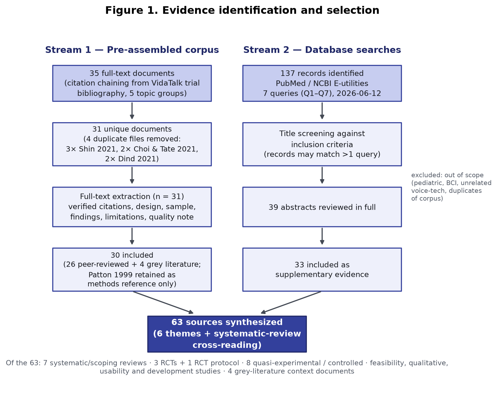
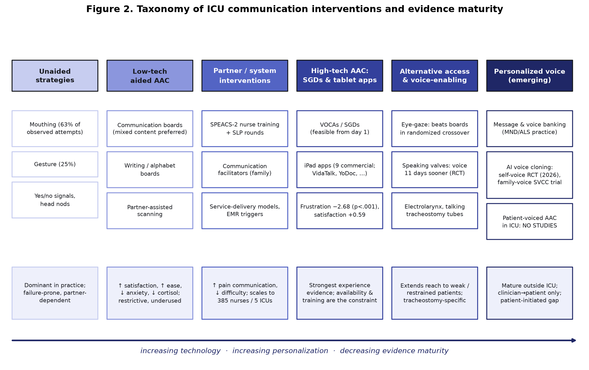

# Communication Interventions for Voiceless Patients in Intensive Care: An Integrative Review from Communication Boards to Personalized Voice Technology

**Authors**: OwnVoice project (AI-assisted review; single human-supervised reviewer)
**Date**: 2026-06-12
**Review Type**: Integrative review with systematic search components
**Review Protocol**: Not registered
**PRISMA Compliance**: Partial (search documentation and flow reporting; no dual independent screening)

---

## Abstract

**Background**: More than 2.7 million ICU patients per year in the United States alone are unable to speak, most commonly because an endotracheal or tracheostomy tube prevents vocalization. Voicelessness is consistently ranked among the most distressing experiences of critical illness, is associated with a threefold risk of preventable adverse events, and burdens family caregivers with high rates of depression, anxiety, and post-traumatic stress.

**Objectives**: To synthesize the evidence on augmentative and alternative communication (AAC) and related communication interventions for communication-impaired adult ICU patients, spanning unaided strategies, low-technology aids, partner-training programs, high-technology devices and tablet applications, eye-gaze systems, voice-enabling strategies, and personalized voice (voice banking and AI voice cloning) technology.

**Methods**: A pre-assembled corpus of 35 documents (31 unique) compiled by citation chaining from the VidaTalk ICU trial literature was extracted in full text. Seven documented PubMed (E-utilities) searches executed on 2026-06-12 identified 137 additional records, of which 39 underwent abstract review and 33 were included. In total 63 sources were synthesized thematically.

**Results**: Evidence converges on five points. (1) The harms of voicelessness are well quantified: 62% of mechanically ventilated patients report high frustration communicating, and unaided methods (mouthing 63%, gesture 25%) dominate practice despite being failure-prone. (2) Low-technology aids (communication boards) improve patient satisfaction and ease of communication and may reduce anxiety and even physiological stress markers, but are restrictive and frequently bypassed. (3) System-level partner-training interventions (SPEACS-2) improve communication about pain and symptoms and scale to hundreds of nurses. (4) High-technology AAC — speech-generating devices and iPad apps — is feasible from the first day of use, reduces communication frustration (−2.68 on a 1–5 scale, p < .001, in the largest quasi-experimental study), and is preferred by patients for emotional and "wordy" content; eye-gaze devices extend access to patients too weak to touch a screen and outperformed communication boards in a randomized crossover. However, the only Cochrane review (11 studies, 1,931 participants) rates the certainty of all effectiveness evidence as low to very low. (5) Personalized voice technology has matured in the neurodegenerative-disease population (message banking, voice banking, AI voice synthesis with >85% perceived similarity), and the first ICU trials of voice cloning — for family-voice care delivery and patient education — began publishing in 2026, but **no study has yet evaluated an AAC system that speaks in the patient's own cloned voice for patient-initiated communication in the ICU**.

**Conclusions**: Communication intervention in the ICU is effective at the level of patient experience (frustration, satisfaction, ease), under-implemented in practice, and methodologically immature at the level of hard outcomes. The convergence of validated ICU phrase sets, tablet feasibility, and consumer-grade on-device voice cloning defines a clear research gap: patient-voice-preserving, tablet-based AAC deployed at the ICU bedside.

**Keywords**: augmentative and alternative communication; intensive care; mechanical ventilation; nonvocal patients; communication boards; speech-generating devices; eye tracking; voice banking; voice cloning

---

## 1. Introduction

### 1.1 Background and Context

Critically ill patients lose the ability to speak for many reasons — endotracheal intubation, tracheostomy, head-and-neck surgery, weakness, and sedation — and the loss is usually sudden and unanticipated. Happ's (2001) state-of-the-science review established what has been replicated ever since: critical care clinicians receive little or no training in interpreting nonvocal communication, and the default bedside repertoire (yes/no questions, lip-reading, gesture) routinely fails. Patak et al. (2004, 2006) quantified the patient experience: 62% of recently extubated patients recalled high frustration trying to communicate their needs, and patients estimated that frustration would have been roughly 60% lower had a communication board been offered. Communication impairment is not merely distressing; patients with communication disorders experience a threefold risk of preventable adverse events in hospital (Bartlett et al., cited in Choi & Tate, 2021), and perceived communication difficulty predicts post-ICU psychological distress (Shin, Tate, & Happ, 2020).

The burden extends to families. In a one-year prospective cohort of 169 caregivers of patients ventilated ≥48 hours, around a third screened positive for depression risk at every time point — comparable to caregivers of people with Alzheimer disease (Van Pelt et al., 2007). Among caregivers of patients ventilated ≥4 days, 90% exceeded the clinical depressive-symptom cutoff during the ICU admission and 61% remained above it two months after discharge (Choi et al., 2012), with persistent fatigue (Choi et al., 2014) and lifestyle restriction lasting six months or more (Choi et al., 2011). Families are not passive bystanders: ethnographic work shows they act as interpreters of the patient's nonvocal communication and as protective monitors during ventilator weaning, and weaning trials were significantly longer on days families were present (Happ et al., 2007). The Facilitated Sensemaking Model formally positions patient–family communication support as a modifiable mechanism for preventing post-intensive-care syndrome in families (Shin et al., 2020), and COVID-19 visiting restrictions — with >1,000 tablets deployed for virtual visiting across >150 UK hospitals in eight weeks — demonstrated both the centrality of family communication and the operational feasibility of bedside tablets at scale (Rose et al., 2020).

Against this backdrop, a wide spectrum of communication interventions has been studied: low-technology aids (communication boards, writing, alphabet boards), partner-training and care-system interventions (SPEACS-2, SLP-led communication rounds), high-technology AAC (speech-generating devices, tablet apps), alternative access methods (eye-gaze), voice-enabling strategies (speaking valves, electrolarynx), and — most recently — personalized voice technology that preserves or reconstructs the patient's own voice.

### 1.2 Scope and Objectives

This review synthesizes the evidence base for communication interventions for adult ICU patients who are temporarily unable to speak, with particular attention to design and implementation lessons for tablet-based AAC.

**Primary research questions:**

1. What are the prevalence and consequences of communication impairment for ICU patients and their families?
2. Which communication interventions have been evaluated in the ICU, and what is the evidence for their effectiveness?
3. What design and implementation factors determine whether high-technology AAC is actually used at the bedside?
4. What is the state of personalized voice technology (message banking, voice banking, AI voice cloning), and what gaps remain in its application to ICU AAC?

### 1.3 Significance

Three literatures are converging without yet meeting: (a) two decades of ICU AAC research establishing feasibility and patient-experience benefit but stalling at low-certainty evidence; (b) a mature voice-banking practice developed for progressive neurodegenerative disease, where speech loss is anticipated; and (c) consumer-grade neural voice synthesis able to clone a voice from minutes of audio. No published study yet evaluates an ICU AAC system that speaks with the patient's own voice. Mapping the first two literatures precisely is the precondition for designing credible studies of the third.

---

## 2. Methodology

### 2.1 Sources and Search Strategy

Two evidence streams were combined.

**Stream 1 — pre-assembled corpus.** Thirty-five full-text documents previously collected by citation chaining from the VidaTalk trial literature (NCT02921776) and its 101-reference bibliography, organized in five topic groups (AAC, ICU communication, ICU-Talk, SPEACS, VidaTalk). De-duplication identified 31 unique documents: three files were copies of Shin, Happ, & Tate (2021); the Choi & Tate (2021) review and the Dind, Starr, & Arora (2021) app analysis each appeared twice under different filenames. All 31 were read in full text, with structured extraction of verified citation metadata (from title pages, not filenames), design, setting, sample, intervention, quantitative findings, author-stated limitations, and a risk-of-bias note.

**Stream 2 — database searches.** Seven PubMed searches were executed via NCBI E-utilities on 2026-06-12 (full query strings in Appendix A):

| # | Topic | Records |
|---|-------|---------|
| Q1 | ICU AAC / communication interventions for nonvocal patients | 27 |
| Q2 | VidaTalk / NCT02921776 publications | 3 |
| Q3 | Voice banking, message banking, voice cloning, synthetic voice | 58 |
| Q4 | Eye-gaze / eye-tracking communication in ICU | 20 |
| Q5 | Communication-board trials in mechanical ventilation | 9 |
| Q6 | Patak / SPEACS lineage / Zaga / speaking-valve trials / Ease of Communication Scale | 14 |
| Q7 | Happ / Koszalinski state-of-science and Speak for Myself | 6 |
| | **Total records screened (titles)** | **137** |

After title screening against the inclusion criteria, 39 records underwent abstract review and 33 were included in the synthesis. Combined with the 30 corpus documents included as evidence or contextual grey literature (Patton, 1999 was used only as a methods reference), **63 sources** inform this review (Figure 1).

### 2.2 Inclusion and Exclusion Criteria

**Included**: studies of adult (≥18 y) patients in intensive or critical care with impaired ability to speak (artificial airway, head-and-neck surgery, or related causes), or their family/clinician communication partners; any communication intervention (unaided, low-tech aided, high-tech aided, partner training, voice-enabling, personalized voice); systematic, scoping, and narrative reviews of the same; and — for the personalized-voice question only — studies of voice/message banking and voice cloning in adjacent populations (motor neuron disease, laryngectomy) where the ICU literature is absent. Quantitative, qualitative, mixed-methods, and development/feasibility designs were all eligible, reflecting the maturity of the field. English language; no date restriction (the foundational work begins in 1988).

**Excluded**: pediatric/neonatal populations; communication in the sense of clinician–family prognostic discussion only (retained selectively as context, e.g., Curtis et al., 2016; Pasricha et al., 2020); brain–computer interfaces (no ICU deployment); studies of long-term AAC users outside acute care.

### 2.3 Screening, Extraction, and Appraisal

A single reviewer (AI-assisted, with five parallel extraction passes over the corpus and cross-checks of every citation against PubMed metadata) performed screening and extraction. Citation metadata were verified against title pages and the PubMed record; two discrepancies were detected and corrected this way (a middle-initial error in a manuscript copy of Happ et al., 2007 — the published record is Arnold RM — and a filename year of "2024" for Shin et al., whose journal-of-record year is 2025). Formal risk-of-bias scoring was not applied; instead, each study carries a design-level quality note, and the GRADE-based judgments of the included systematic reviews (especially Rose et al., 2021; Zaga et al., 2019) anchor the certainty statements.

### 2.4 Synthesis

Findings were synthesized narratively under six themes ordered along the intervention spectrum (Figure 2): consequences of voicelessness (§3.1), low-technology AAC (§3.2), partner-training and system-level interventions (§3.3), high-technology AAC and tablet applications (§3.4), eye-gaze and alternative access (§3.5), and voice restoration and personalized voice (§3.6), followed by a cross-cutting reading of the systematic-review evidence (§3.7).

---

## 3. Results

### 3.1 The Problem: Prevalence and Consequences of Voicelessness

The descriptive literature is the most internally consistent part of the field. In Patak et al.'s (2006) interviews with 29 recently extubated patients, 62% reported high frustration communicating their needs; the same group's earlier study found that clinician behaviors — being kind, informative, and physically present versus mechanical, inattentive, and "absent" — materially shaped the experience (Patak et al., 2004). Observational work during the development of ICU-Talk in Dundee documented *how* patients actually communicate: across 406 observed communication attempts by 12 intubated patients over 30 hours, mouthing accounted for 63% and gesture 25%; nurses were the partner in 44% of exchanges; and the most frequent messages were "I need a cough [suction]," "I need a drink," and "Thank you" (Judson et al., 2000). Crucially, only about 25% of the 190 phrases that nurses had predicted patients would need were ever attempted; 56% of observed utterances were patient-specific (Etchels et al., n.d.; Judson et al., 2000) — an early, replicated warning that fixed phrase sets built from clinician intuition cover less than half of what patients want to say.

Interview studies converge on the same unmet needs. In an Edinburgh ICU, all 13 interviewed patients had relied on yes/no responses and body language, but found closed questioning insufficient ("doesn't help me gain an understanding of what's happening to me"); staff believed pain was well communicated while patients reported that its specifics were not; and patients' priority topics were discomfort, emotional expression and reassurance, trust, and orientation to their treatment plan (Sii, McCulloch, & Swann, 2015). Mobasheri et al. (2016), interviewing ex-ICU patients, relatives, and staff, distilled hardware, software, and content requirements for future aids and flagged staff training and bedside assessment as adoption gatekeepers. Symptom assessment in nonvocal patients remains a measurement problem in its own right, requiring validated self-report and observational instruments with minimal patient burden (Choi et al., 2017). Reviews of the qualitative literature add the affective consequences: frustration, anxiety, powerlessness, depersonalization, and a "heightened sense of death" (Ariffin, Ludin, & Arifin, 2020).

Family-side evidence completes the picture (§1.1): high and persistent caregiver depression (Van Pelt et al., 2007; Choi et al., 2012), fatigue (Choi et al., 2014), and lifestyle restriction (Choi et al., 2011); families acting as interpreters and protective monitors (Happ et al., 2007); and a theoretical framework — Facilitated Sensemaking — that treats supported patient–family communication as a protective intervention for families (Shin et al., 2020). Serious-illness communication work shows what is at stake in content terms: when surrogates of mechanically ventilated patients completed a structured Serious Illness Conversation, the patient abilities most often named as indispensable were independence and functional abilities *including speech* (55.6%), social interaction (47.2%), and mental awareness (36.1%) (Pasricha et al., 2020).

### 3.2 Low-Technology AAC: Boards, Writing, and Their Limits

The oldest controlled study in this literature is also emblematic of its strengths and limits. Stovsky, Rudy, and Dragonette (1988) quasi-randomized 40 cardiac-surgery patients to a pre-operatively introduced communication board versus nurse improvisation and found significantly higher patient satisfaction with the board (t = 2.09, p = .05). Thirty-six years later, the design is still being replicated with similar results: in Iran, a quasi-experimental study (n = 30) found communication boards improved ease of communication (z = −4.69, p = .001) and reduced anxiety (z = −2.98, p = .003) (Hosseini, Valizad-Hasanloei, & Feizi, 2018); a randomized trial (n = 60) found board use lowered serum cortisol and significantly reduced systolic and diastolic blood pressure and heart rate relative to control (Divani et al., 2022); and in India, a quasi-experimental study (n = 80) found higher satisfaction at day 5 (37.85 vs 34.32, p = .034) (Sidhu et al., 2024).

The 2025 mixed-methods systematic review of low-technology AAC (32 studies) consolidates this: boards improve satisfaction, facilitate communication, and address physical and psychological needs; patients prefer mixed-content boards (pictures + words + letters); and yet boards are used *less* than unaided strategies because of patient medical status, tool availability, and staff attitudes — with pre-operative introduction recommended where intubation is planned (Alodan et al., 2025). The implementation failure mode was identified much earlier: in a secondary analysis of 127 SPEACS-trial patients, family members were involved with AAC for 44% of patients, with pen-and-paper writing the dominant strategy, but materials simply left in rooms went unused — "families just made do" — and writing was repeatedly defeated by edema, weakness, restraints, and missing eyeglasses (Broyles, Tate, & Happ, 2012). Deployed practice kits, such as Northern Health's (2020) ICU Assisted Communication Toolkit, codify the craft knowledge (yes/no signal calibration with known-answer questions, partner-assisted scanning protocols, symbol boards spanning needs/feelings/personal care/medical questions) but remain unevaluated grey literature.

In the only head-to-head usability comparison of boards versus tablet apps — 30 older adults including post-ICU and head-and-neck-surgery patients — low-tech boards beat three commercial apps on task completion for emotional and bathroom-need tasks and on ease of use (p = .002), although VidaTalk was the most preferred app (30% of participants) and apps were judged potentially effective *given training* (Nilsen et al., 2018). The recurring lesson is that low-tech aids are cheap, robust, and effective when actually offered, but restrictive (no novel utterances at distance, no voice output) and dependent on a trained partner.

### 3.3 Partner-Training and System-Level Interventions: SPEACS and Its Descendants

The largest and most influential intervention program in this field targets nurses rather than patients. The SPEACS trial (quasi-experimental, 3-phase sequential cohort: usual care → basic communication skills training → AAC materials + speech-language pathologist consultation; 89 intubated patients, 30 nurses, two ICUs) found that successful communication exchanges about pain were more frequent in both intervention phases (p = .03), the AAC + SLP group used significantly more AAC methods (p = .002) and reported high communication difficulty less often (p < .01) (Happ et al., 2014). The packaged successor, SPEACS-2 — six web-based modules, unit-based communication resource nurses, weekly SLP-led bedside "communication rounds," and a low-tech materials cart — was described with case-level detail showing how first-line strategies fail under sensory and motor impairment and how SLP assessment recovers workable channels (eye-gaze yes/no signals, first-letter mouthing, amplification) (Happ et al., 2010). Pragmatic scale-up is feasible: a quality-improvement implementation trained 385 nurses across five ICUs and measured significant improvement in patients' Ease of Communication Scale scores from baseline to the second post-intervention period (25.86 → 21.22, p = .027; N = 354 nonvocal patients) (Trotta et al., 2020).

Two adjacent system-level results frame what communication interventions can and cannot buy. A randomized trial of trained communication *facilitators* (n = 168 patients; 268 family members) — targeting clinician–family rather than patient communication — reduced family depressive symptoms at 6 months (adjusted 2.4 vs 4.7, p = .017), halved ICU costs among decedents, and shortened ICU stay among decedents by ~21 days without changing mortality (Curtis et al., 2016). And the Serious Illness Conversation Guide proved adaptable to ICU surrogates with high acceptability (95% rated it worthwhile) though only 50% fidelity in completion (Pasricha et al., 2020). Grey-literature service-delivery frameworks (an interdisciplinary AAC team, a stocked "AAC station," SLP referral pathways) operationalize the Joint Commission's 2010 patient-communication standards but have no empirical evaluation (Lloyd, 2018).

### 3.4 High-Technology AAC: Speech-Generating Devices and Tablet Applications

**Feasibility era (2000–2012).** Happ, Roesch, and Garrett (2004) demonstrated in 11 intubated MICU patients that electronic voice-output communication aids were usable by seriously ill adults: 73% used the devices with minimal instruction, patient-initiated exchanges were more frequent in device-mediated events (36.4% vs 16.7%), and ease-of-communication scores improved (31.1 → 17.8, p = .047, n = 6) — while cataloguing the barrier set every later study replicates: device positioning, fluctuating patient condition, staff time and unfamiliarity, and message-navigation complexity. The most common message, notably, was "I love you" (n = 9). The Dundee ICU-Talk project — the first purpose-built computerized aid actually deployed with intubated ICU patients (May 2001 onward) — contributed the vocabulary-construction method (nurse elicitation + patient observation + next-of-kin computer interview generating up to 80 personalized phrases) and the honest feasibility findings: six patients communicated successfully; 90% of surveyed nurses endorsed the need for a computer-based aid; but 71% felt the hardware obstructed their view of the patient, and the dominant software problem was that patients could not discover what phrases existed in a ~250-phrase hierarchy (Judson et al., 2000; MacAulay et al., 2002; Etchels et al., n.d.). Rodriguez et al. (2012) added granular deployment data for a tablet-based speech-generating device prototype with "suddenly speechless" patients (n = 11): ≥73% independent hot-button activation on day 1 after a 10-minute orientation, but the device was within arm's reach only 52% of the time and fully functional at only 68% of checks — availability, not capability, was the binding constraint.

**Effectiveness era (2015–present).** The strongest quantitative evidence for tablet AAC is Rodriguez et al.'s (2016) two-site quasi-experimental study (n = 115 analyzed): an iPad-based SGD (pictorial hot-buttons with recorded speech, handwriting, typing) plus urgent button, versus usual care plus urgent button, reduced communication frustration by 2.68 points on a 5-point scale (95% CI −3.02 to −2.34, p < .001) and increased satisfaction (+0.59, p < .0001), with the largest satisfaction gains for communicating with relatives, comfort needs, and symptoms. Usage telemetry doubles as an empirical phrase-set specification: of 5,889 hot-button activations, symptom management accounted for 31% (pain alone 22%), requests for a person 19%, thanks 7.6%, bathroom 5.8%, and "I love you" 5.6%. Notably, patients typed 6,448 free-text messages — more than all preset-button uses combined — confirming the Dundee finding that preset phrases cover only part of communication need. Koszalinski's Speak for Myself line showed similar feasibility (95% of 20 ICU patients found it helpful; Koszalinski, Tappen, & Viggiano, 2015) and proceeded to a controlled study of anxiety and depression outcomes (Koszalinski et al., 2020). For patients who cannot touch a screen, a hand-operated non-touchscreen speech-output device (MOCS) has been developed for dexterity-impaired ICU patients (Goldberg et al., 2021).

**The VidaTalk evidence cluster.** The most complete tablet-AAC research program is the NIH-funded VidaTalk STTR program (NCT02921776; PI Happ) — and it is best read as one linked single-site body of evidence rather than independent studies. The pilot RCT randomized 63 alert intubated adults to a tablet with the VidaTalk app (preset spoken messages, pain body-map, typing, finger drawing) versus an attention-control tablet. The published companion studies report family-side outcomes: in 28 family caregivers, no between-group psychological outcome reached significance (the pilot was powered only for d ≥ 1.1), but effect-size signals favored the intervention for anxiety at 1 month (d = 0.43) and PTSD-related symptoms (IES-R below the clinical cutoff in the intervention group at 1 and 3 months, η² = 0.07–0.09) (Shin et al., 2025). Qualitatively, seven interviewed family members described VidaTalk as having "opened up" communication — clearer messages, expanded topics (symptoms, finances, treatment, emotions), five of seven families receiving an "I love you," and an unexpected rehabilitative use (hand–eye coordination) — alongside barriers of sedation, weakness, and tablet handling, and the emotionally double-edged effect of *understanding* a suffering patient better (Shin, Happ, & Tate, 2021). The patient-level primary outcomes of the parent RCT (sedation exposure, delirium, frustration, communication difficulty) had not been identified as published at the time of this review — a notable reporting gap given the protocol's pre-registration (NCT02921776 protocol).

**The commercial app landscape.** Dind, Starr, and Arora (2021) bench-evaluated the available iPad communication apps (9 of 18 candidates analyzed): seven were ICU-specific; only two (VidaTalk, YoDoc) supported finger/stylus drawing; four offered >8 languages (Patient Communicator the most at 18; VidaTalk 19 per its feature table); and four were judged unsuitable for routine ICU use for reasons including English-only content, non-intuitive navigation, and poor pain tools. The authors' verdicts — YoDoc most suitable overall; VidaTalk feature-rich but expensive (USD 169/year) with small text — together with the vendor's own deployment model (EMR flags, SLP referral within 24 h, daily communication care plans, CPT 92607–92609 reimbursement; VidaTalk, ca. 2023) define the current commercial baseline a new entrant must exceed. Technology-acceptance evidence is favorable: across 18 studies (914 patients), voiceless ICU patients perceived high-tech AAC as useful and easy to use, with reduced communication difficulty and negative emotion (Ju, Yang, & Liu, 2021).

### 3.5 Eye-Gaze and Alternative Access

Eye-tracking extends AAC to patients excluded from touch interfaces by weakness, edema, or restraints — a population every touch-based study lists among its exclusions. Feasibility was established early (Garry et al., 2016: positive psychosocial impact, PIADS +1.30, p = .004) and at scale by the French ICU group: among 151 awake intubated patients using a purpose-built eye-tracking interface, 82% selected at least one icon and 64% completed the full calibration-and-selection sequence, with fatigue and eyelid opening the main failure modes (Bodet-Contentin et al., 2022; initial experience: Bodet-Contentin, Gadrez, & Ehrmann, 2018). German trauma-ICU work used commercial eye-gaze devices (Tobii Dynavox) to administer structured basic-needs and symptom questionnaires to 64 invasively ventilated patients — pain on repositioning (69%), thirst (69%), and sleep disruption (66%) led the list, and 67% of patients said the device itself improved their quality of life (Ull et al., 2022). A single-arm pilot of an audio-content eye-interaction device (EyeControl-Med) reported improved Loewenstein Communication Scale scores (+19.3, p < .0001) and fewer CAM-ICU errors (Bendavid et al., 2023, industry-funded).

The pivotal comparison is Szymkowicz et al. (2024): a randomized crossover (44 ventilated patients, 88 exchanges) of a conventional communication board versus an ICU eye-tracking device. Eye tracking doubled the median messages per exchange (4 vs 2, p < .0001), achieved a 100% versus 80% success rate (p < .05), and inverted satisfaction (board: 66% "not satisfied"; eye tracking: 100% satisfied or very satisfied, p < .0001). A 2026 scoping review (11 studies) concludes eye-tracking is effective for needs communication and symptom assessment but calls for multicenter RCTs (Jin et al., 2026). The relevance to touch-first tablet AAC is direct: eye-gaze is simultaneously a competitor modality and the natural fallback access method for the substantial minority of ICU patients who cannot reliably point.

### 3.6 Voice Restoration and Personalized Voice: From Speaking Valves to Voice Cloning

**Restoring the larynx.** For tracheostomized patients, the most direct intervention is restoring airflow to the vocal folds. The only RCT (n = 30) found early cuff deflation with an in-line speaking valve restored phonation a median 11 days sooner (HR 3.66, 95% CI 1.54–8.68) with no increase in complications (Freeman-Sanderson et al., 2016). Talking tracheostomy tubes achieve audible voicing in 74–100% of patients across eight studies but carry secretion and airway-management concerns; the electrolarynx helps mainly tracheostomized patients and degrades with weakness (ten Hoorn et al., 2016; Choi & Tate, 2021). These options are unavailable to orally intubated patients — the majority of the ventilated ICU population — for whom AAC with synthetic or recorded speech output is the only "voice."

**Whose voice? The personalization literature.** Until recently, AAC voice output meant a small set of generic synthetic voices — "often, several individuals in a group setting use the same synthetic voice" (Mills, Bunnell, & Patel, 2014). The personalization literature matured in motor neuron disease (MND/ALS), where speech loss is foreseeable. Message banking — recording one's own phrases in advance, developed at Boston Children's Hospital — and voice banking — recording a phoneme-covering inventory to train a personalized text-to-speech voice — are now structured clinical processes, including "double-dipping" banked messages to train synthetic voices (Costello & Smith, 2021). A scoping review (23 studies) distinguishes message banking, voice banking, and voice conversion/reconstruction as distinct strategies and finds the literature heterogeneous, with a "pressing need" for published clinical implementation models (Pu et al., 2025). Qualitative work establishes *why* this matters: for people with MND, preserving identity is the overarching motivation to bank a voice — "fighting back" against the disease — though expectations frequently outrun understanding of how AAC actually sounds and behaves (Cave & Bloch, 2021).

Technical quality has crossed a threshold. In an 831-listener evaluation, voices built with DNN-based statistical parametric synthesis were more intelligible, more natural, and preferred over waveform-concatenation voices banked by speakers with dysarthria (Hyppa-Martin et al., 2024); accent-specific inventories can produce locale-appropriate synthetic voices (Singapore Colloquial English; Chen et al., 2023); and fine-tuned neural vocoders (HiFi-GAN) now produce patient-specific voices from recordings of ALS patients with "exceptional expressive and audio quality" (Regondi et al., 2025). These results were obtained with cooperative speakers recording structured inventories — a luxury the suddenly speechless ICU patient does not have, which is precisely why few-shot voice cloning (minutes or seconds of found audio) rather than classical voice banking is the relevant technology for acute care.

**Voice cloning reaches the ICU (2026).** Two trials published in early 2026 mark the entry of AI voice cloning into inpatient care, both using cloned voices to speak *to* patients. A three-arm RCT of AI-assisted patient education (n = 180) found education delivered in the patient's *own* cloned voice outperformed both physician-voice cloning and conventional education on compliance (92.5 vs 86.7 vs 73.2, p < .001), knowledge retention, adherence (d = 0.74 at 1 month), and anxiety/depression scores — attributing the effect to self-reference processing (Sun et al., 2026). And a registered RCT protocol (n = 234; NCT06743321) will test Speech-to-Speech Voice-Cloning Care — nurses delivering awakening, soothing, and extubation-preparation scripts in a *family member's* cloned voice — against ICU-acquired anxiety in mechanically ventilated patients (Li et al., 2026). The direction of communication in both is clinician→patient. **No identified study evaluates the complementary direction: an AAC system in which the voiceless patient initiates communication that is rendered in the patient's own cloned voice.** Given that (a) "I love you" is among the most frequent and most valued AAC messages in every ICU study that counted (Happ et al., 2004; Rodriguez et al., 2016; Shin et al., 2021), (b) identity preservation is the central motivation for voice personalization (Cave & Bloch, 2021), and (c) self-voice effects measurably change clinical outcomes even in passive listening (Sun et al., 2026), patient-voiced AAC in acute care is a conspicuous, testable gap.

### 3.7 What the Systematic Reviews Agree On

Seven systematic or scoping reviews now cover this field, and their convergence is informative.

| Review | Scope | Included | Headline conclusion |
|---|---|---|---|
| ten Hoorn et al., 2016 | All communication methods, MV patients | 29 studies | All four intervention classes can work; quality poor-to-moderate; proposes selection algorithm |
| Carruthers et al., 2017 | AAC for temporary voicelessness | 12 studies | More interactions, higher satisfaction, fewer difficulties; "preliminary but inconsistent" evidence |
| Zaga et al., 2019 | Communication interventions, MV ICU | 48 studies | Feasible, useful, safe; evidence mostly low/very-low (30/48 very low) |
| Ju et al., 2021 | High-tech AAC acceptance | 18 studies / 914 patients | Patients find high-tech AAC useful, easy, anxiety-reducing; willing to continue |
| Rose et al., 2021 (Cochrane) | Communication aids, artificial airway | 11 studies / 1,931 participants | Evidence "insufficient to guide practice"; satisfaction signal for boards (SMD 2.92, very low certainty); calls for core outcome set |
| Alodan et al., 2025 | Low-tech AAC | 32 studies | Effective and preferred mixed-content boards; underused relative to unaided strategies |
| Cabrini et al., 2025 | All aids, ventilated ICU | 42 studies | No single tool superior; individualized selection is the only defensible strategy |

Three consistent messages emerge. First, *direction of effect*: essentially every comparative study, whatever its design, finds communication aids improve patient-experience outcomes (frustration, satisfaction, ease, anxiety). Second, *certainty*: the Cochrane review's verdict — very-low-certainty evidence, heterogeneous outcome measurement, no study reporting its primary outcome — is the methodological reality check; the field measures experience with a dozen different instruments and almost never measures hard outcomes (delirium, ventilation duration, length of stay) with adequate power. Third, *individualization over instrument*: both 2016 and 2025 reviews land on assessment-driven selection (the SPEACS-2 algorithm operationalizes this: cognition → oral-motor → comprehension → expressive strategy, escalating to SLP consultation; Choi & Tate, 2021) rather than any single winning tool — implying that multimodal systems (preset phrases *and* free text *and* drawing *and* alternative access) fit the evidence better than single-mode devices.

---

## 4. Discussion

### 4.1 Synthesis of Principal Findings

The evidence base has an unusual shape: a strong, decades-deep consensus on the problem; consistent positive findings on patient experience across every intervention class; and persistent failure to convert this into high-certainty effectiveness evidence or routine practice. The implementation literature explains much of the gap. Devices fail at the bedside for mundane reasons — out of reach 44% of the time, powered off, not repositioned after transfers (Rodriguez et al., 2012) — and AAC materials without instruction go unused (Broyles et al., 2012). Nurse-side programs (SPEACS-2) are the best-evidenced remedy, and the more recent acceptability literature confirms staff attitudes and training remain the decisive variables (Istanboulian et al., 2019; Alodan et al., 2025).

### 4.2 Design Implications for Tablet-Based AAC

Read as a requirements document, the corpus specifies a bedside tablet AAC system with some precision:

1. **Vocabulary must be empirically grounded and personalizable.** Clinician-predicted phrase sets cover ~25% of actual patient utterances (Judson et al., 2000); message-frequency telemetry (pain 22%, summon person 19%, gratitude 7.6%, bathroom 5.8%, affection 5.6%; Rodriguez et al., 2016) plus free-text generation (more typed messages than all preset uses combined) define the floor: rich preset coverage of needs/symptoms *plus* unconstrained text entry *plus* personalized content sourced from family.
2. **Pain deserves a dedicated, structured pathway** (location, intensity, quality) — it is the single most frequent topic, the one staff most overestimate their grasp of (Sii et al., 2015), and the one with validated nonvocal instruments (Choi et al., 2017).
3. **Emotional and relational content is not optional.** "I love you" recurs as the most meaningful message across two decades of studies; tools that only cover care needs miss what patients and families value most (Happ et al., 2004; Shin et al., 2021).
4. **Interaction cost must fit fatigued, edematous, possibly restrained users**: day-one usability after ≤10 minutes of orientation is achievable and should be the standard (Rodriguez et al., 2012); navigation depth, not feature count, was ICU-Talk's failure mode; small text and undiscoverable features were the recurring app complaints (Nilsen et al., 2018; Dind et al., 2021).
5. **Multilingual support is a differentiator** in current commercial apps (9–19 languages; Dind et al., 2021) and an equity requirement (1 in 15 US adults has limited English proficiency; Choi & Tate, 2021).
6. **Plan for alternative access.** A substantial minority of candidates cannot touch reliably; eye-gaze outperformed boards in the only randomized crossover (Szymkowicz et al., 2024) and defines the fallback modality.
7. **Deployment is a program, not an app**: EMR triggers, SLP involvement within 24 h, daily communication care plans, and staff training are what made SPEACS-2 and the VidaTalk implementation model work (Happ et al., 2010; Trotta et al., 2020; VidaTalk, ca. 2023).

### 4.3 Research Gaps

1. **Patient-voiced AAC.** The personalized-voice literature stops at the ICU door: voice banking assumes anticipated speech loss; the new ICU voice-cloning trials use cloned voices only in the clinician→patient direction (Li et al., 2026; Sun et al., 2026). An AAC system speaking in the patient's own cloned voice — enrollable from brief recordings, including pre-intubation capture for planned airway surgery, mirroring the pre-operative-introduction recommendation for boards (Alodan et al., 2025) — has no published evaluation. Both the identity-preservation rationale (Cave & Bloch, 2021) and the self-voice outcome effects (Sun et al., 2026) predict benefit; neither has been tested for patient-initiated communication.
2. **Core outcomes and powered trials.** The Cochrane review's call for a core outcome measurement set remains unanswered; candidate instruments exist (Ease of Communication Scale, validated repeatedly from Happ et al., 2004 through Trotta et al., 2020; clinimetric review in Zaga et al., 2022).
3. **Unpublished patient-level results** of the only tablet-AAC RCT (NCT02921776) should be reported or replicated.
4. **Family-mediated personalization** — next-of-kin interviews generated up to 80 personalized phrases per patient in 2002 (Etchels et al.) and families are the natural source of voice samples and vocabulary today; no modern study has operationalized this.
5. **Equity**: multilingual and low-literacy adaptation, and the digital divide in older adults (Nilsen et al., 2018; Choi & Tate, 2021), remain under-studied.

### 4.4 Limitations of This Review

This review was conducted by a single (AI-assisted) reviewer without dual independent screening or formal risk-of-bias scoring; supplementary searches used PubMed only (though the included systematic reviews collectively cover Embase, CINAHL, Cochrane, PsycINFO, and Web of Science); and the pre-assembled corpus was seeded by citation chaining from one research program (VidaTalk/Happ), creating a known clustering risk that we mitigated by treating linked studies as single evidence bodies and by independent database searches. Grey literature (vendor documentation, clinical toolkits) is cited as context, never as effectiveness evidence. Publication bias likely inflates the consistency of positive experience outcomes; no included quantitative synthesis permitted funnel-plot assessment.

---

## 5. Conclusions

Forty years of research establishes that voicelessness in intensive care is common, harmful to patients and families, and partially remediable with tools as simple as a laminated board and as sophisticated as eye-gaze speech generation. Every intervention class improves communication experience; none has high-certainty evidence on hard outcomes; and implementation — availability, training, and workflow — repeatedly proves to be the binding constraint rather than technology. The field's own data specify the next system: multimodal, empirically-grounded vocabulary with free text, structured pain communication, relational content, day-one usability, multilingual reach, and programmatic deployment. The most distinctive open opportunity is restoring not just communication but *voice*: no published study yet gives a suddenly speechless ICU patient back their own voice for patient-initiated communication, even as the constituent technologies — validated ICU phrase sets, bedside tablets, and few-shot neural voice cloning — are each individually proven.

---

## Appendix A: Search Strategy Documentation

All searches: PubMed via NCBI E-utilities, executed 2026-06-12, sorted by relevance, no date limits.

**Q1** (n = 27): `("intensive care"[tiab] OR "critically ill"[tiab] OR ICU[tiab] OR "mechanically ventilated"[tiab]) AND (nonvocal[tiab] OR "nonverbal"[tiab] OR voiceless[tiab] OR "unable to speak"[tiab] OR "communication impair*"[tiab]) AND ("augmentative and alternative communication"[tiab] OR "communication aid"[tiab] OR "communication board"[tiab] OR "communication intervention"[tiab] OR "speech-generating"[tiab] OR AAC[tiab])`

**Q2** (n = 3): `VidaTalk[tiab] OR (Happ[au] AND tablet[tiab] AND "intensive care"[tiab]) OR NCT02921776[si]`

**Q3** (n = 58): `("voice banking"[tiab] OR "message banking"[tiab] OR "voice preservation"[tiab] OR "personalized synthetic voice"[tiab] OR "synthetic voice"[tiab] OR "voice cloning"[tiab]) AND (communication[tiab] OR AAC[tiab] OR "augmentative"[tiab] OR speech[tiab])`

**Q4** (n = 20): `("eye gaze"[tiab] OR "eye-tracking"[tiab] OR "eye tracking"[tiab]) AND ("intensive care"[tiab] OR "mechanically ventilated"[tiab] OR ICU[tiab]) AND (communication[tiab] OR AAC[tiab])`

**Q5** (n = 9): `"communication board"[tiab] AND ("mechanically ventilated"[tiab] OR "intensive care"[tiab] OR intubated[tiab]) AND (trial[tiab] OR randomized[tiab] OR quasi-experimental[tiab] OR effect[tiab])`

**Q6** (n = 14): `(Patak L[au] AND (frustration[tiab] OR "communication board"[tiab])) OR (Happ MB[au] AND "Nurse-patient communication interactions"[ti]) OR (Zaga CJ[au] AND systematic[tiab]) OR (Freeman-Sanderson[au] AND voice[tiab]) OR (Trotta R[au] AND SPEACS[tiab]) OR ("ease of communication scale"[tiab])`

**Q7** (n = 6): `(Happ MB[au] OR Koszalinski R[au]) AND ("speak for myself"[tiab] OR "state of the science"[tiab] OR epidemiology[tiab]) AND (communication[tiab] OR voiceless[tiab])`

---

## References

Alodan HA, Sutt A-L, Hill R, Alsadhan J, Cross JL. (2025). Effectiveness, experience, and usability of low-technology augmentative and alternative communication in intensive care: A mixed-methods systematic review. *Australian Critical Care*, 38(1), 101061. https://doi.org/10.1016/j.aucc.2024.04.006

Ariffin SM, Ludin SM, Arifin SRM. (2020). Being voiceless: A review on patient communication in intensive care unit. *Systematic Reviews in Pharmacy*, 11(12), 1328–1333.

Bendavid I, Assi S, Sasson N, Statlender L, Hellerman M, Fishman G, Singer P, Kagan I. (2023). The EyeControl-Med device, an alternative tool for communication in ventilated critically ill patients: A pilot study examining communication capabilities and delirium. *Journal of Critical Care*, 78, 154351. https://doi.org/10.1016/j.jcrc.2023.154351

Bodet-Contentin L, Gadrez P, Ehrmann S. (2018). Eye-tracking and speech-generating technology to improve communication with intubated intensive care unit patients: initial experience. *Intensive Care Medicine*, 44(5), 676–677. https://doi.org/10.1007/s00134-018-5093-0

Bodet-Contentin L, Szymkowicz E, Delpierre E, Chartier D, Gadrez P, Muller G, Renault A, Ehrmann S. (2022). Eye tracking communication with intubated critically ill patients: a proof-of-concept multicenter pilot study. *Minerva Anestesiologica*, 88(9), 690–697. https://doi.org/10.23736/S0375-9393.22.16275-9

Broyles LM, Tate JA, Happ MB. (2012). Use of augmentative and alternative communication strategies by family members in the intensive care unit. *American Journal of Critical Care*, 21(2), e21–e32. https://doi.org/10.4037/ajcc2012752

Cabrini L, Spinazza G, Bazzotti C, Cavallari R, Baiardo Redaelli M, Grossi AA. (2025). "Giving voice" to the voiceless: a systematic review of communication aids for ventilated patients in intensive care units. *Minerva Anestesiologica*, 91(6), 573–581. https://doi.org/10.23736/S0375-9393.25.18851-2

Carruthers H, Astin F, Munro W. (2017). Which alternative communication methods are effective for voiceless patients in Intensive Care Units? A systematic review. *Intensive and Critical Care Nursing*, 42, 88–96. https://doi.org/10.1016/j.iccn.2017.03.003

Cave R, Bloch S. (2021). Voice banking for people living with motor neurone disease: Views and expectations. *International Journal of Language & Communication Disorders*, 56(1), 116–129. https://doi.org/10.1111/1460-6984.12588

Chen M, Hyppa-Martin J, Bunnell HT, Lilley J, Foo C, Tan HW, Lim WS. (2023). Voice banking to support individuals who use speech-generating devices: development and evaluation of Singaporean-accented English synthetic voices and a Singapore Colloquial English recording inventory. *Augmentative and Alternative Communication*, 39(4), 208–218. https://doi.org/10.1080/07434618.2023.2181213

Choi J, Campbell ML, Gélinas C, Happ MB, Tate J, Chlan L. (2017). Symptom assessment in non-vocal or cognitively impaired ICU patients: Implications for practice and future research. *Heart & Lung*, 46(4), 239–245. https://doi.org/10.1016/j.hrtlng.2017.04.002

Choi J, Donahoe MP, Zullo TG, Hoffman LA. (2011). Caregivers of the chronically critically ill after discharge from the intensive care unit: six months' experience. *American Journal of Critical Care*, 20(1), 12–23. https://doi.org/10.4037/ajcc2011243

Choi J, Sherwood PR, Schulz R, Ren D, Donahoe MP, Given B, Hoffman LA. (2012). Patterns of depressive symptoms in caregivers of mechanically ventilated critically ill adults from intensive care unit admission to 2 months postintensive care unit discharge: a pilot study. *Critical Care Medicine*, 40(5), 1546–1553. https://doi.org/10.1097/CCM.0b013e3182451c58

Choi J, Tate JA. (2021). Evidence-based communication with critically ill older adults. *Critical Care Clinics*, 37(1), 233–249. https://doi.org/10.1016/j.ccc.2020.09.002

Choi J, Tate JA, Hoffman LA, Schulz R, Ren D, Donahoe MP, Given BA, Sherwood PR. (2014). Fatigue in family caregivers of adult intensive care unit survivors. *Journal of Pain and Symptom Management*, 48(3), 353–363. https://doi.org/10.1016/j.jpainsymman.2013.09.018

Costello J, Smith M. (2021). The BCH message banking process™, voice banking, and double-dipping™. *Augmentative and Alternative Communication*, 37(4), 241–250. https://doi.org/10.1080/07434618.2021.2021554

Curtis JR, Treece PD, Nielsen EL, Gold J, Ciechanowski PS, Shannon SE, Khandelwal N, Young JP, Engelberg RA. (2016). Randomized trial of communication facilitators to reduce family distress and intensity of end-of-life care. *American Journal of Respiratory and Critical Care Medicine*, 193(2), 154–162. https://doi.org/10.1164/rccm.201505-0900OC

Dind AJ, Starr JS, Arora S. (2021). iPad-based apps to facilitate communication in critically ill patients with impaired ability to communicate: A preclinical analysis. *Indian Journal of Critical Care Medicine*, 25(11), 1232–1240. https://doi.org/10.5005/jp-journals-10071-24019

Divani A, Manookian A, Haghani S, Meidani M, Navidhamidi M. (2022). Evaluating the use of communication board on cortisol level and physiological parameters in mechanically ventilated patients. *Iranian Journal of Nursing and Midwifery Research*, 27(3), 198–203. https://doi.org/10.4103/ijnmr.ijnmr_82_21

Etchels M, Ashraf S, MacAulay F, Judson A, Ricketts IW, Waller A, Brodie JK, Alm N, Warden A, Shearer AJ, Gordon B. (n.d., ca. 2002). Capturing phrases for ICU-Talk, a communication aid for intubated intensive care patients. Conference paper, University of Dundee / Ninewells Hospital. [Venue and year not printed on available copy.]

Freeman-Sanderson AL, Togher L, Elkins MR, Phipps PR. (2016). Return of voice for ventilated tracheostomy patients in ICU: A randomized controlled trial of early-targeted intervention. *Critical Care Medicine*, 44(6), 1075–1081. https://doi.org/10.1097/CCM.0000000000001610

Garry J, Casey K, Cole TK, Regensburg A, McElroy C, Schneider E, Efron D, Chi A. (2016). A pilot study of eye-tracking devices in intensive care. *Surgery*, 159(3), 938–944. https://doi.org/10.1016/j.surg.2015.08.012

Goldberg MA, Hochberg LR, Carpenter D, Walz JM. (2021). Development of a Manually Operated Communication System (MOCS) for patients in intensive care units. *Augmentative and Alternative Communication*, 37(4), 261–273. https://doi.org/10.1080/07434618.2021.2016958

Happ MB. (2001). Communicating with mechanically ventilated patients: state of the science. *AACN Clinical Issues*, 12(2), 247–258. https://doi.org/10.1097/00044067-200105000-00008

Happ MB, Baumann BM, Sawicki J, Tate JA, George EL, Barnato AE. (2010). SPEACS-2: intensive care unit "communication rounds" with speech language pathology. *Geriatric Nursing*, 31(3), 170–177. https://doi.org/10.1016/j.gerinurse.2010.03.004

Happ MB, Garrett KL, Tate JA, DiVirgilio D, Houze MP, Demirci JR, George E, Sereika SM. (2014). Effect of a multi-level intervention on nurse-patient communication in the intensive care unit: results of the SPEACS trial. *Heart & Lung*, 43(2), 89–98. https://doi.org/10.1016/j.hrtlng.2013.11.010

Happ MB, Roesch TK, Garrett K. (2004). Electronic voice-output communication aids for temporarily nonspeaking patients in a medical intensive care unit: a feasibility study. *Heart & Lung*, 33(2), 92–101. https://doi.org/10.1016/j.hrtlng.2003.12.005

Happ MB, Swigart VA, Tate JA, Arnold RM, Sereika SM, Hoffman LA. (2007). Family presence and surveillance during weaning from prolonged mechanical ventilation. *Heart & Lung*, 36(1), 47–57. https://doi.org/10.1016/j.hrtlng.2006.07.002

Hosseini SR, Valizad-Hasanloei MA, Feizi A. (2018). The effect of using communication boards on ease of communication and anxiety in mechanically ventilated conscious patients admitted to intensive care units. *Iranian Journal of Nursing and Midwifery Research*, 23(5), 358–362. https://doi.org/10.4103/ijnmr.IJNMR_68_17

Hyppa-Martin J, Lilley J, Chen M, Friese J, Schmidt C, Bunnell HT. (2024). A large-scale comparison of two voice synthesis techniques on intelligibility, naturalness, preferences, and attitudes toward voices banked by individuals with amyotrophic lateral sclerosis. *Augmentative and Alternative Communication*, 40(1), 31–45. https://doi.org/10.1080/07434618.2023.2262032

Istanboulian L, Rose L, Yunusova Y, Gorospe F, Dale C. (2019). Barriers to and facilitators for use of augmentative and alternative communication and voice restorative devices in the adult intensive care unit: a scoping review protocol. *Systematic Reviews*, 8, 311. https://doi.org/10.1186/s13643-019-1232-0

Jin H, Jing M, Xu X, Zhao Y, Zhu Y, Li J, Li L. (2026). Eye-tracking in communication use for mechanically ventilated ICU patients: A scoping review. *Nursing in Critical Care*, 31(1), e70303. https://doi.org/10.1111/nicc.70303

Ju XX, Yang J, Liu XX. (2021). A systematic review on voiceless patients' willingness to adopt high-technology augmentative and alternative communication in intensive care units. *Intensive and Critical Care Nursing*, 63, 102948. https://doi.org/10.1016/j.iccn.2020.102948

Judson A, MacAulay F, Etchels M, Ricketts IW, Waller A, Brodie J, Warden A, Alm N, Shearer A, Gordon B. (2000). Developing ICU-Talk — a computer based communication aid for patients in intensive care. In *Proceedings, IEEE conference* (pp. 370–376). IEEE. [Conference title not printed on available copy.]

Koszalinski RS, Tappen RM, Viggiano D. (2015). Evaluation of Speak for Myself with patients who are voiceless. *Rehabilitation Nursing*, 40(4), 235–242. https://doi.org/10.1002/rnj.186

Koszalinski RS, Heidel RE, Hutson SP, Li X, Palmer TG, McCarthy J, et al. (2020). The use of communication technology to affect patient outcomes in the intensive care unit. *CIN: Computers, Informatics, Nursing*, 38(4), 183–189. https://doi.org/10.1097/CIN.0000000000000597

Li M, Yang Y, Hao J, Xue Y, Weng D, Jiang H, Song W, Yang Y, Long Y. (2026). Speech-to-Speech Voice-Cloning Care (SVCC) for improving ICU-acquired anxiety for critically ill patients in a tertiary hospital in Beijing, China: protocol of a randomised, controlled trial. *BMJ Open*, 16(3), e101227. https://doi.org/10.1136/bmjopen-2025-101227

Lloyd B. (2018). *Augmentative and alternative communication in the intensive care unit: A service delivery model* (Graduate Independent Study No. 10). Illinois State University. https://ir.library.illinoisstate.edu/giscsd/10 [Grey literature.]

MacAulay F, Judson A, Etchels M, Ashraf S, Ricketts IW, Waller A, Brodie JK, Alm N, Warden A, Shearer AJ, Gordon B. (2002). ICU-Talk, a communication aid for intubated intensive care patients. In *Proceedings of the Fifth International ACM Conference on Assistive Technologies (ASSETS 2002)* (pp. 226–230). ACM.

Mills T, Bunnell HT, Patel R. (2014). Towards personalized speech synthesis for augmentative and alternative communication. *Augmentative and Alternative Communication*, 30(3), 226–236. https://doi.org/10.3109/07434618.2014.924026

Mobasheri MH, King D, Judge S, Arshad F, Larsen M, Safarfashandi Z, Shah H, Trepekli A, Trikha S, Xylas D, Brett SJ, Darzi A. (2016). Communication aid requirements of intensive care unit patients with transient speech loss. *Augmentative and Alternative Communication*, 32(4), 261–271. https://doi.org/10.1080/07434618.2016.1235610

Nilsen ML, Morrison A, Lingler JH, Myers B, Johnson JT, Happ MB, Sereika SM, DeVito Dabbs A. (2018). Evaluating the usability and acceptability of communication tools among older adults. *Journal of Gerontological Nursing*, 44(9), 30–39. https://doi.org/10.3928/00989134-20180808-07

Northern Health. (2020). *ICU assisted communication toolkit* (Document 10-800-6024, IND 04/20). Northern Health, British Columbia. [Grey literature.]

Patak L, Gawlinski A, Fung NI, Doering L, Berg J. (2004). Patients' reports of health care practitioner interventions that are related to communication during mechanical ventilation. *Heart & Lung*, 33(5), 308–320. https://doi.org/10.1016/j.hrtlng.2004.02.002

Patak L, Gawlinski A, Fung NI, Doering L, Berg J, Henneman EA. (2006). Communication boards in critical care: patients' views. *Applied Nursing Research*, 19(4), 182–190. https://doi.org/10.1016/j.apnr.2005.09.006

Patton MQ. (1999). Enhancing the quality and credibility of qualitative analysis. *Health Services Research*, 34(5 Pt 2), 1189–1208.

Pasricha V, Gorman D, Laothamatas K, Bhardwaj A, Ganta N, Mikkelsen ME. (2020). Use of the Serious Illness Conversation Guide to improve communication with surrogates of critically ill patients: A pilot study. *ATS Scholar*, 1(2), 119–133. https://doi.org/10.34197/ats-scholar.2019-0006OC

Pu S, Sawyer A, Levinson C, Putrino D, Kirke DN. (2025). Exploring voice banking as an alternative augmentative communication strategy for individuals with dysphonia, aphonia, and dysarthria: A scoping review. *Journal of Voice*, advance online publication. https://doi.org/10.1016/j.jvoice.2025.10.018

Regondi S, Donvito G, Frontoni E, Kostovic M, Minazzi F, Bratières S, Filosto M, Pugliese R. (2025). Artificial intelligence empowered voice generation for amyotrophic lateral sclerosis patients. *Scientific Reports*, 15, 1361. https://doi.org/10.1038/s41598-024-84728-y

Rodriguez CS, Rowe M, Koeppel B, Thomas L, Troche MS, Paguio G. (2012). Development of a communication intervention to assist hospitalized suddenly speechless patients. *Technology and Health Care*, 20(6), 489–500. https://doi.org/10.3233/THC-2012-0695

Rodriguez CS, Rowe M, Thomas L, Shuster J, Koeppel B, Cairns P. (2016). Enhancing the communication of suddenly speechless critical care patients. *American Journal of Critical Care*, 25(3), e40–e47. https://doi.org/10.4037/ajcc2016217

Rose L, Cook A, Casey J, Meyer J. (2020). Restricted family visiting in intensive care during COVID-19. *Intensive and Critical Care Nursing*, 60, 102896. https://doi.org/10.1016/j.iccn.2020.102896

Rose L, Sutt A-L, Amaral AC, Fergusson DA, Smith OM, Dale CM. (2021). Interventions to enable communication for adult patients requiring an artificial airway with or without mechanical ventilator support. *Cochrane Database of Systematic Reviews*, 10, CD013379. https://doi.org/10.1002/14651858.CD013379.pub2

Shin JW, Happ MB, Tate JA. (2021). VidaTalk™ patient communication application "opened up" communication between nonvocal ICU patients and their family. *Intensive and Critical Care Nursing*, 66, 103075. https://doi.org/10.1016/j.iccn.2021.103075

Shin JW, Tate JA, Happ MB. (2020). The Facilitated Sensemaking Model as a framework for family-patient communication during mechanical ventilation in the intensive care unit. *Critical Care Nursing Clinics of North America*, 32(2), 335–348. https://doi.org/10.1016/j.cnc.2020.02.013

Shin JW, Tan A, Tate J, Balas M, Dabelko-Schoeny H, Happ MB. (2025). Preliminary efficacy of the VidaTalk™ communication application on family psychological symptoms in the intensive care unit: A pilot study. *Heart & Lung*, 70, 14–22. https://doi.org/10.1016/j.hrtlng.2024.11.001

Sidhu S, Kaur K, Kaur A, Charan GS, Kaur M. (2024). Effectiveness of communication board on level of satisfaction among mechanically ventilated patients at intensive care unit in a tertiary hospital. *International Journal of Applied and Basic Medical Research*, 14(4), 284–289. https://doi.org/10.4103/ijabmr.ijabmr_351_24

Sii SZ, McCulloch C, Swann D. (2015). Communication with ventilated patients in ICU: Perceptions on existing communication methods and needs. *Res Medica*, 23(1), 2–14. https://doi.org/10.2218/resmedica.v23i1.1216

Stovsky B, Rudy E, Dragonette P. (1988). Comparison of two types of communication methods used after cardiac surgery with patients with endotracheal tubes. *Heart & Lung*, 17(3), 281–289.

Sun Y, Xu S, Jin H, Han X, Jin K, Zhang Y, Ma X, Wei H, Ma M. (2026). Effectiveness of AI-assisted patient health education using voice cloning and ChatGPT: Prospective randomized controlled trial. *Journal of Medical Internet Research*, 28, e81387. https://doi.org/10.2196/81387

Szymkowicz E, Bodet-Contentin L, Marechal Y, Ehrmann S. (2024). Comparison of communication interfaces for mechanically ventilated patients in intensive care. *Intensive and Critical Care Nursing*, 80, 103562. https://doi.org/10.1016/j.iccn.2023.103562

ten Hoorn S, Elbers PW, Girbes AR, Tuinman PR. (2016). Communicating with conscious and mechanically ventilated critically ill patients: a systematic review. *Critical Care*, 20, 333. https://doi.org/10.1186/s13054-016-1483-2

Trotta RL, Hermann RM, Polomano RC, Happ MB. (2020). Improving nonvocal critical care patients' ease of communication using a modified SPEACS-2 program. *Journal for Healthcare Quality*, 42(1), e1–e9. https://doi.org/10.1097/JHQ.0000000000000163

Ull C, Hamsen U, Weckwerth C, Schildhauer TA, Gaschler R, Waydhas C, Jansen O. (2022). Approach to the basic needs in patients on invasive ventilation using eye-tracking devices for non-verbal communication. *Artificial Organs*, 46(3), 439–450. https://doi.org/10.1111/aor.14082

Van Pelt DC, Milbrandt EB, Qin L, Weissfeld LA, Rotondi AJ, Schulz R, Chelluri L, Angus DC, Pinsky MR. (2007). Informal caregiver burden among survivors of prolonged mechanical ventilation. *American Journal of Respiratory and Critical Care Medicine*, 175(2), 167–173. https://doi.org/10.1164/rccm.200604-493OC

VidaTalk (Vidatak LLC). (ca. 2023). *VidaTalk program comprehensive guide*. [Vendor grey literature.]

Zaga CJ, Berney S, Vogel AP. (2019). The feasibility, utility, and safety of communication interventions with mechanically ventilated intensive care unit patients: A systematic review. *American Journal of Speech-Language Pathology*, 28(3), 1335–1355. https://doi.org/10.1044/2019_AJSLP-19-0001

Zaga CJ, Cigognini B, Vogel AP, Berney S. (2022). Outcome measurement tools for communication, voice and speech intelligibility in the ICU and their clinimetric properties: A systematic review. *Journal of the Intensive Care Society*, 23(4), 459–472. https://doi.org/10.1177/1751143720963757

